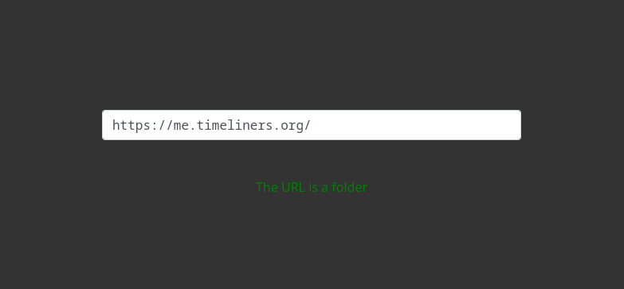
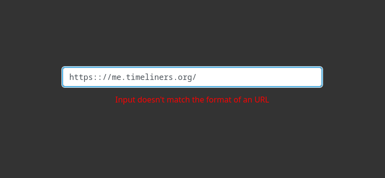

# Tuta-Demo

Small Programming Task for Tuta

This small application checks an input if it has the format of an URL and then fetches a result from a (mock-)server if it is a file or folder.

## Installation

1. Install dependencies

```sh
npm i
#OR
pnpm i
```

2. Build script
```sh
npm run build
#OR
pnpm build
```

2. Open the index.html

## Timetable
- Project & Git setup - 13 min
- Completing the given task - 52 min + 2 min additional error handling (which could happen with the non mock version)
- Adding styling - 15 min
- Writing documentation - 8 min

## Images



